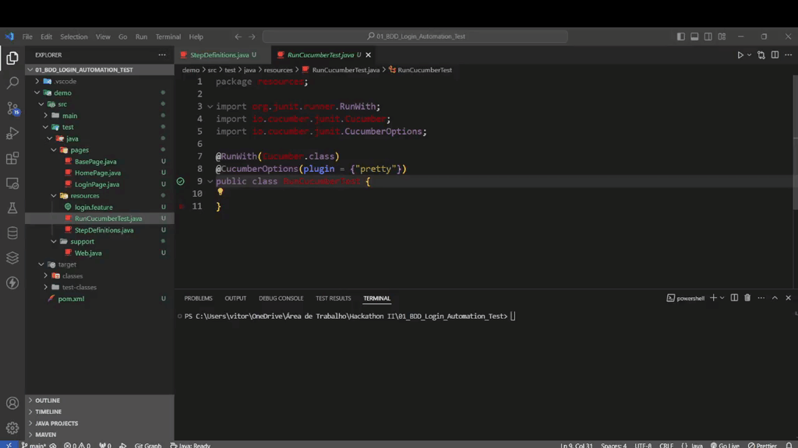
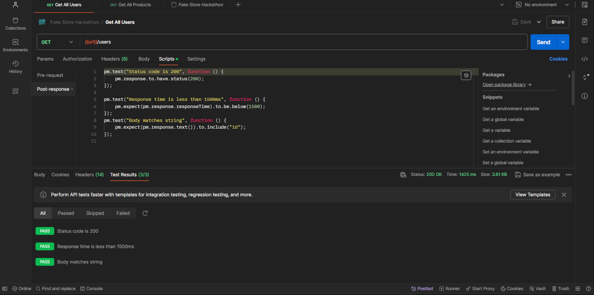
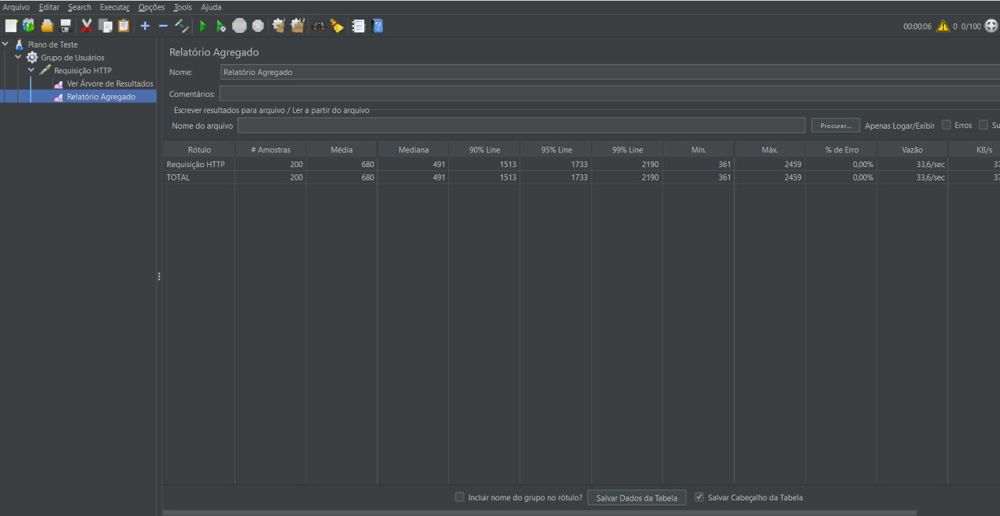

## HACKATHON QA
This respository has 3 challenges developed in the Hackathon QA from IT Talent Programme's Quality Assurance course.

The challenges are: 
1. Login test automation case, with scenario test written in Gherkin for BDD using Cucumber, Selenium, JUnit and Page Objects design pattern;
2. API testing, using Postman;
3. Performance testing, using JMeter.

---
### 1. Login test case automation

**Exercise:** 
- Create a login test case automation from the [Homero](https://homero.app.br) website.

**Scenario tests:**
- Login with empty password

**Tools:**<br>


**Pre-requisites:**<br>
- Maven: version 22
- JUnit: version 4.13.2
- Cucumber-java, Cucumber-junit and Cucumber-core: version 7.18.0
- Selenium-java: version 4.22.0

**Project structure:**
```
.
demo
  ├───src
       ├───main
       │   ├───java
       │   │   └───com
       │   │       └───example
       │   └───resources
       └───test
           └───java
               ├───pages
               ├───resources
               └───support
  
```
- Pages: Contains the class to initialize the WebDriver and the website pages classes
    - BasePage.java: Base page class created to initialize the WebDriver
    - HomePage.java: Class created for the Home Page
    - LoginPage.java: Class created for the Login Page

- Resources: Contains the file to write the test case and scenario test, the class to define the scenario test steps, and the class to run Cucumber
    - login.feature: Test case and scenario test written in Gherkin
    - RunCucumberTest.java: Class created to set up and run Cucumber
    - StepDefinitions.java: Class created to define the scenario test steps

- Support: Contains the WebDriver settings
    - Web.java> WebDriver settings and default URL for testing

**Results:**

</img>


---
### 2. API Testing

**Exercise:** 
- Create an API testing from the [Fake Store API](https://fakestoreapi.com) website, using the GET request to get all registered users in the API.

**Tools:**<br>


**Results:**

</img>

---
### 3. Performance Testing

**Exercise:** 
- Create a performance testing from the [Fake Store API](https://fakestoreapi.com) website, using one of the avaliable HTTP requests.

**Tools:**<br>


**Results:**

</img>